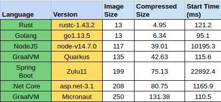
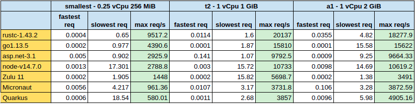

[Best Language for the “Simple App”]("https://medium.com/@emreodabas_20110?source=post_page-----979729d3e48d--------------------------------")

_Aug 30, 2020·4 min read_

---

if you are a tech people for a while, most probably you found yourself trying to answer such questions; I’ll just write a Simple App and

*   Which language do I have to use?
*   Which language is best for this app?
*   Which one is faster, easier, popular, etc.?

And always we have a **quick** and **correct** answer such questions.

> It depends.

Most of the time, this answer not satisfy and the conversation continues with more abstract, out of focus questions and uncertain/blurry answers.

With this post, I try to find some measured answers for _Simple App_ for answering solid questions.

So what are we looking for?
---------------------------

Let’s say, we’ll create an application that just returns given static data. That sounds very simple, right? With this application, we try to find which language is the most Efficient!

For calculating efficiency, I’ll define restricted resources and without any scaling ability for each test case. For example, I’m looking for the highest throughput for all apps limited into 1vCPU, 0.5 GiB memory. Which is the same with the smallest EC2 container of AWS (t2.nano)

I’ll measure the below metrics for evaluating programming languages.

*   Throughput per Second
*   Docker Image Size
*   App Start Time

Which languages?
----------------

When it comes to selecting languages, there are lots of options to select. Depending on my background, I chose the below list\*\*;

*   [Spring Boot](https://spring.io/projects/spring-boot) with Java 11\*
*   [Quarkus](https://quarkus.io/) with GraalVM 11\*
*   [Micronaut](https://micronaut.io/) with GraalVM 11\*
*   [NodeJS](https://nodejs.org/en/)
*   [Golang](https://golang.org/)
*   [Rust](https://www.rust-lang.org/)
*   [.Net Core](https://dotnet.microsoft.com/download/dotnet-core)
*   [Python](https://github.com/emreodabas/hello-app/blob/master/hello-app-python)\*\*\*

\* With my Java background, I just try to cut down Java alternatives to 3 (most used and new challengers). I have so much curiosity about what happened if I use Java 11,14,16 with different JDK providers like OpenJDK, ZuluJDK, OracleJDK, and AdoptOpenJDK. But I don’t want to add a new battle area for this post and maybe this will be another post subject.  
\*\* I’ll probably add Phyton, bare Java, Ruby, Elixir, C++ but it will get time. If you are happy to implement any of them, feel free to PR.  
\*\*\* Even I [implemented Python](https://github.com/emreodabas/hello-app/blob/master/hello-app-python/main.py), I could not get any valid results (without timeout error) for any test case. I tried to change HTTP servers but all of them failed. I am very sad to not able to add Python so if you know a better way to implement [bare python](https://github.com/emreodabas/hello-app/blob/master/hello-app-python/main.py) please defend python

Writing Codes
-------------

When it comes to developing applications for each language, I restrict myself to _not use_ any extra library/framework. For example, I wrote the Nodejs app without express. Spring Boot is the only exception to this situation because it is [the most used](http://clariontech.com/blog/5-best-technologies-to-build-microservices-architecture) for microservices.

Also, I try to define minimum sized docker images as much as possible. You could find all codes in [Github](https://github.com/emreodabas/hello-app) and images are [docker hub](https://hub.docker.com/u/emreodabas).

It’s Time to Test
=================

For this Simple App test, I‘ll use the [Hey](https://github.com/rakyll/hey) load tool. This tool is very simple and useful. For all apps, I’ll use the same test script including warming up servers.

> \# concurrent 100 for 1 minute
> 
> hey -c 100 -z 1m [http://node1-k8s:${nodePort}/medium](http://node1-k8s:${nodePort}/medium)

Results
=======

Image Sizes & Start Time
------------------------

With these [results](https://docs.google.com/spreadsheets/d/1Llq9qUJ_hvtXntz_Xl9aKizvly86ZFvTnBWGplOG2Mc/edit?usp=sharing), Rust and Golang’s image sizes are the smallest. Rust is an absolute winner with compressed size comparison. 4.5 and 6.3 Mb are very impressive results that depending on their designs. Both languages generate their binaries without any runtime dependencies. So, even a bare Alpine image is enough to run services.

NodeJS and Quarkus images have relatively good image sizes. These image sizes mostly cacheable in most cloud environments but also affect continuous delivery SLAs.

Golang has the fastest start time, Micronaut, Quarkus, and Rust also follow it very closely. NodeJS and Spring Boot have the dramatically slowest start times.

For the first impressions, Rust and Golang are shining. Spring Boot is disappointed me. Quarkus give the best results in Java alternatives.

Throughputs & Resources
-----------------------

Detailed results could be seen in this [link](https://docs.google.com/spreadsheets/d/1UJfEKKdIGrphPgs2mVPJOLqDRnWcEvjlFYPdhFdYoHI/edit?usp=sharing).

As you can see, Rust has the highest throughput in all types of machines and the only language has 20k+ throughput.

Golang is the 2nd fastest and it comes closer to Rust performance with increasing machine resources.

.Net Core and Nodejs are the main followers with reasonable performances.

Java contenders are relatively slow and not stable as much as expected. Java seems not a good performer on restricted resources. Also gives so much timeout error when the load is higher. Zulu 11 is more stable than OpenJDK 11.

Almost all test cases, services use all Cpu power except Rust. Rust is not consumed all Cpu and Memory even load increased relatively. This could be another search topic for Rust.

Wrapping Up
===========

Even with this _Simple App_ approach, it is very hard to decide which language is the best. Because several expectations need to be handled by programming languages. Easy to use/learn, readability, powerful, stable, rich frameworks/libraries, package managers, public repositories, communities, open-source projects, etc. Most of these are subjective things and usually disregardable by our feelings like passions, conservativeness. Besides these advantages and disadvantages, my numbers say Rust and Golang are the bests.

Takeaways
=========

*   Rust is the best performer on low resources.
*   Rust and Golang has the smallest docker images sizes
*   Golang has the fastest startup time.
*   .NodeJS and .Net Core good challangers.
