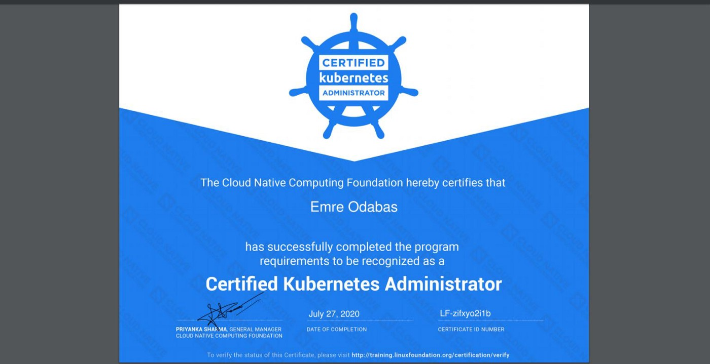
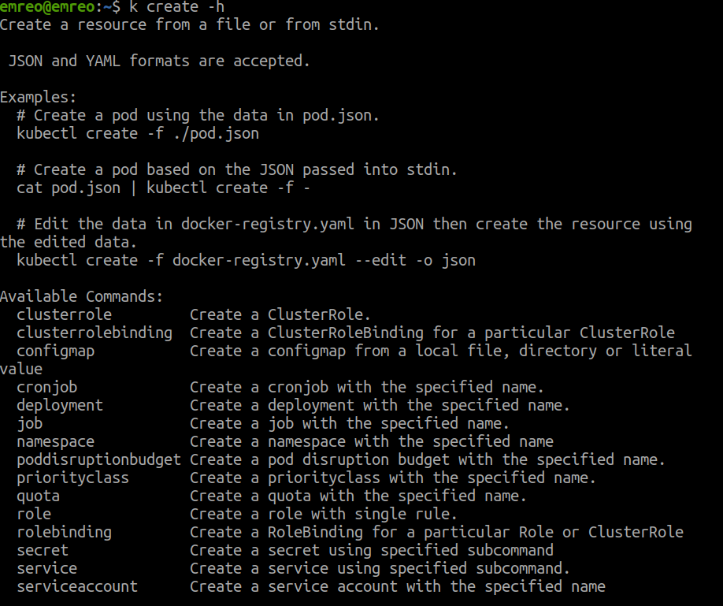
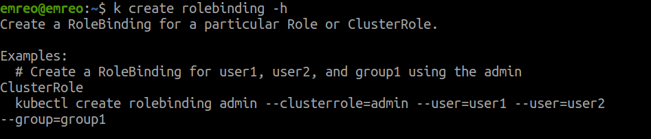

_Sep 9, 2020·3 min read_ 

As a classic of CKA stories, let’s start with my certificate with a score 97

And Let’s jump into the subject. As may know, CKA is a practical exam and you need to have high kubectl skills. This experience directly affects your time management and stress level on the exam. So, let’s talk about practices.

**Alias Kubectl**

The first move of the exam;

> alias k=kubectl

Even It may seem insignificant on your first impressions, this 6 character reduction becomes more meaningful when you aware 100+ command you’ll write on the exam. It also reduces possible typo mistakes that could be annoying if you misunderstand the error. If you like the alias idea, you could check [kubectl-aliases](https://github.com/ahmetb/kubectl-aliases) for daily usage. With these aliases, you will execute your commands mostly in up to 8–10 characters.

Bookmarks
---------

[kubernetes.io](http://kubernetes.io) will be the only documentation source while you are in the exam. You used to find solutions on kubernetes.io. If you are not much familiar with these pages, searching and could not finding solutions will be very disturbing. You could use predefined bookmarks that match problems and solutions to each other. You could download [my bookmarks](https://github.com/emreodabas/cheatsheets/releases/download/links/cka-bookmarks.html) that cover most of the subjects on the exam (Kubernetes 1.18). Before the exam, check all pages of bookmarks and create a temporary cache on your mind.

Imperative Commands
-------------------

Kubectl is a very powerful CLI tool. And it fascinates me whenever deep dive into details. With kubectl, you could use imperative or declarative commands. If I need to explain these shortly;

*   [Imperative commands](https://kubernetes.io/docs/tasks/manage-kubernetes-objects/imperative-command/) are about the actions that need to be done.
*   [Declarative commands](https://kubernetes.io/docs/tasks/manage-kubernetes-objects/declarative-config/) are about the results that you desired.

For example, you could write a YAML file and create a deployment with _kubectl apply_ command, declaratively. But you could gain more time with choosing the imperative way that writing the “_kubectl create deployment”_ command. In the end, Imperative commands are very useful for faster implementations.

You could use _help_ command very effectively for imperative commands. Kubectl help gives available parameters and commands examples that very helpful to copy and paste.

As you could see above, there are so many resources that could be created by this imperative command. Most of the RBAC questions could be concluded successfully without a written YAML file.

Besides the _“create”_ command, you need to learn _“run”_ command details that is exactly the best way for running new pods. Also, “_label, expose, scale,_ and _taint” commands are very_ time-efficient solutions.

Dry-Run Dry-Run Dry-Run
-----------------------

When you could not create resources with the imperative way, you could run away to write a full YAML file with the perfect feature; Dry-Run. Dry-run needs to be one of the most used commands in the exam. Create and edit a YAML file is a good practice for gaining time.

> k … — dry-run=client -o yaml > abc.yaml

Also, copying a YAML file from existing resources is another best practice too.

> k get … -o yaml > abc.yaml

Kubectl CheatSheet
------------------

Kubernetes [CheatSheet page](https://kubernetes.io/docs/reference/kubectl/cheatsheet/) needs to be seen before the exam. This page is like an assurance for forgetting commands or usages. There are handy examples for commands like _jsonpath_, _selector_, _custom-columns,_ and _patch_, etc. Also, this page is good for copy and paste commands instead of losing time to write.

Takeaways
---------

*   Alias k for Kubectl
*   [Bookmarks](https://github.com/emreodabas/cheatsheets/releases/download/links/cka-bookmarks.html) for documentation
*   [Imperative Commands](https://kubernetes.io/docs/tasks/manage-kubernetes-objects/imperative-command/)
*   Use dry-run if you need a YAML
*   [CheatSheet](https://kubernetes.io/docs/reference/kubectl/cheatsheet/) at hand
