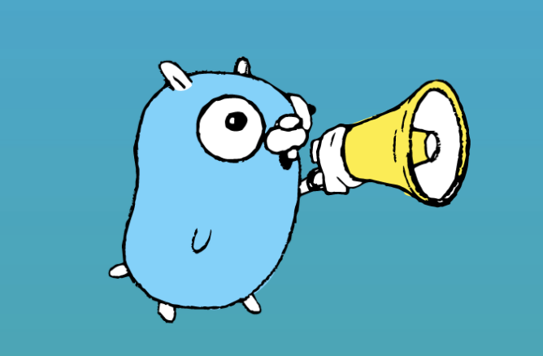
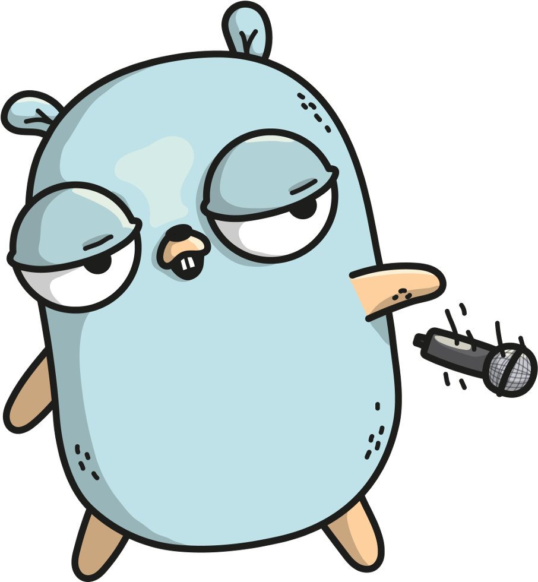

_Dec 10, 2021 ·4 min read_ [](https://medium.com/@emreodabas_20110/quick-guide-go-1-18-features-e236d5b351ef)

With the Go 1.18 version, which is planned to be released in the first quarter of 2022, many new features are waiting for us.

This version will be one of the most critical packages of Go history and we will reach the beta version probably in a month. So what are these changes?



Type Parameters (Generics)
==========================

The long-awaited “Type Parameter” feature in Go  is actually known as Generics in some other languages. With this feature, we can give dynamic types to our functions. Let’s dive into a simple example and write a function that finds the minimum value of any two _int_ variables.

```
func minInt(x int, y int) int {  
   if x < y {  
      return x  
   } else {  
      return y  
   }  
}
```

When we need the same functionality for float32, we need to rewrite the same thing also for float32.

```
func minFloat(x float32, y float32) float32 {  
   if x < y {  
      return x  
   } else {  
      return y  
   }  
}
```

With the power of Type Parameters, we could easily define a function that could get desired types of variables. For defining types, we also encounter a new operator called `tilde ~`. This operator actually returns us the interface of the type information, so we can make our type restrictions. Let's write the same min function that covers int and float32 types as below.

```
type OrderTypes interface {   
   ~int | ~float32   
}func min\[P OrderTypes\](x, y P) P {  
    if x < y {  
      return x  
    } else {  
      return y  
    }  
}
```

It seems pretty solid, right? Go is also proposed a [constraints](https://github.com/golang/go/blob/master/src/constraints/constraints.go) library that contains already defined type groups. For example, we could implement our function for all ordered types.

```
func min\[P constraints.Ordered\](x, y P) P {  
    if x < y {  
      return x  
    } else {  
      return y  
    }  
}
```

Of course, the use of generics is not limited to this sample. It could be very useful especially in ORM-style problems that we generally create functions that work with multiple types. As well, you could check these [examples](https://github.com/golang/go/tree/dev.go2go/src/cmd/go2go/testdata/go2path/src) shared by the Go team also give you some ideas. If you desire to watch the details, there is a great [presentation](https://youtu.be/KepBhuQJT9E) the team made at GopherCon.  
Apart from these, the [online editor (playground)](https://gotipplay.golang.org/) where we can experiment will also be useful. If you wish to try 1.18 in your own environment, you could download [_gotip_](https://gotipplay.golang.org/) and work with the active branch of Go.

Fuzzing Test
============

With the Golang 1.18 package, the ["Fuzzing"](https://go.dev/blog/fuzz-beta) feature will come into our lives. With this test library, which will be offered as beta, we will be able to automatically make random mutations of our inputs in unit tests.

As software developers, we sometimes miss unit tests edge cases. And this lack of data diversity could be abused and used in security leaks and vulnerabilities especially on critical libraries. We could prevent this situation using Fuzzing Test.

For implementing Fuzzing Test, you could wrap your unit tests with a method that name starts with the Fuzz prefix. You could also use the [Go Testing](https://pkg.go.dev/testing@master#hdr-Fuzzing) page as a sample code.

```
func FuzzHex(f \*testing.F) {  
  for \_, seed := range \[\]\[\]byte{ {}, {0}, {9}, {0xa}, {0xf}, {1, 2, 3, 4}} {  
    f.Add(seed)  
  }  
  f.Fuzz(func(t \*testing.T, in \[\]byte) {  
    enc := hex.EncodeToString(in)  
    out, err := hex.DecodeString(enc)  
    if err != nil {  
      t.Fatalf("%v: decode: %v", in, err)  
    }  
    if !bytes.Equal(in, out) {  
      t.Fatalf("%v: not equal after round trip: %v", in, out)  
    }  
  })  
}
```

Workspaces
==========

This feature comes to facilitates developers' jobs, who work on multiple modules at the same time. Although the module version can be changed with the replace command in `go.mod` version 1.17, it is often forgotten to clear these replace commands while committing the code. Inserting or removing that line every time is a very bothering thing to do for these developers.

With the [Workspace](https://go.googlesource.com/proposal/+/master/design/45713-workspace.md) feature, you could create a new file called `go.work` and write the replace command there. This file allows us to change modules specific to our working environment without touching the existing `go.mod` file. As an example, you could look at the property’s [proposed design page](https://go.googlesource.com/proposal/+/master/design/45713-workspace.md).

```
go 1.17  
  
directory (  
    ./baz // foo.org/bar/baz  
    ./tools // golang.org/x/tools  
)  
  
replace golang.org/x/net => example.com/fork/net v1.4.5
```

> As a result, Go 1.18 comes with the useful Fuzzing and Workspaces features, along with the Generics feature that was [discussed](https://dzone.com/articles/go-doesnt-need-generics), [talked](https://go.dev/blog/why-generics) and [introduced](https://go.googlesource.com/proposal/+/refs/heads/master/design/43651-type-parameters.md) more than a year. Apart from that, many improvements and fixes will also be in this version. You can follow the status of the version and what it contains via this [link](https://github.com/golang/go/milestone/201).


[

Generics in Go Explained with Code Examples
-------------------------------------------

### Generics were proposed a few years ago for Go, and they have finally been accepted into the language earlier this year…

www.freecodecamp.org

](https://www.freecodecamp.org/news/generics-in-golang/)[

Playing with Go and Generics
----------------------------

### Yes, it’s happening! The proposal to add generics to Golang was accepted. It means that in some versions in the future…

drgarcia1986.medium.com

](https://drgarcia1986.medium.com/playing-with-go-and-generics-bba6961b14a0)[

Fuzzing in Go
-------------

### Fuzzing is a testing technique with randomized inputs that is used to find problematic edge cases or security problems…

lwn.net

](https://lwn.net/Articles/829242/)[

Go Fuzzing
----------

### Fuzzing is a type of automated testing which continuously manipulates inputs to a program to find bugs. Since fuzzing…

go.dev

](https://go.dev/doc/fuzz/)
